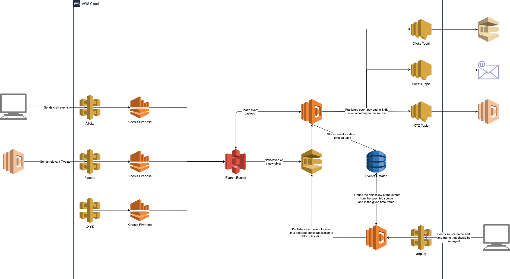

# Serverless DataLake

> A Serverless DataLake example written using CDK Python.

This project provisions a Serverless [DataLake](https://en.wikipedia.org/wiki/Data_lake) on AWS with a REST API for event ingestion and replay, and SNS Topics for event distribution.



## Installation

To run this app, you will need to install AWS CDK in your machine.

```sh
npm install -g aws-cdk
cdk --version
```

## Development setup

To setup a development enviroment, please follow the steps below.

First you will need a Python virtual environment.

```
$ python3 -m venv .env
```

After the init process completes and the virtualenv is created, you can use the following
step to activate your virtualenv.

```
$ source .env/bin/activate
```

If you are a Windows platform, you would activate the virtualenv like this:

```
% .env\Scripts\activate.bat
```

Once the virtualenv is activated, you can install the required dependencies.

```
$ pip install -r requirements.txt
```

At this point you can now synthesize the CloudFormation template for this code.

```
$ cdk synth
```

To add additional dependencies, for example other CDK libraries, just add
them to your `setup.py` file and rerun the `pip install -r requirements.txt`
command.

## Meta

Developed by Fernando Gonçalves – [LinkedIn](https://www.linkedin.com/in/fernandosg/)

Distributed under the [MIT](LICENSE) license.

## Contributing

1. Fork it
2. Create your feature branch (`git checkout -b feature/fooBar`)
3. Commit your changes (`git commit -am 'Add some fooBar'`)
4. Push to the branch (`git push origin feature/fooBar`)
5. Create a new Pull Request
